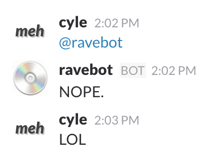

# Slack Text Avatar Bot Script Thing

Recently I've enjoyed having an avatar in Slack that's just word art. Pretty simple:



But I hate having to make them over and over again. So why not have a script that does it? A bot, maybe?

This script takes a bunch of potential words to use, and picks one at random, and makes an avatar, and sends it to Slack.

## Installation

Make sure you have Node.js 4.x or above installed.

This uses `node-canvas` to do the fancy drawing, so you have to install that first: check out the [node canvas docs](https://github.com/Automattic/node-canvas).

Now clone this repo and copy `config.sample.js` to `config.js` and edit it as you see fit.

Note that technically you don't need to integrate with Slack at all... you can just set `post_to_slack: false` and this script will just save your avatar locally as `text_avatar.png` and you can manually upload it to Slack. Whatever, it's cool.

The most important bits of the config are:

- `potential_texts` -- an array of arrays, each sub-array containing the words to use per line. Check out the examples.
- `which_font_file` -- a path to an actual `.ttf` file with the font you want to use to render the text. I love [Lato Black Italic](http://www.latofonts.com/).
- `slack_api_token` -- if you want to run this as a cron job or something and auto-update your Slack avatar, you gotta put your user's API key here.

## Usage

Now that you have everything installed and your `config.js` file filled out, time to use it. Open up a shell/terminal, go to this folder, and:

```
$> node bot.js
```

That's it. You should see some helpful messages in your terminal window. You should also see `text_avatar.png` saved.

Run it over and over again to try out random words. See how it feels.

Also, if you want to manually specify a word, you can supply it directly:

```
$> node bot.js wat
```

or two words, each will be on a new line:

```
$> node bot.js lol wat
```

## To do list

Some neat things to do...

- [ ] Better Slack support. It's lazy right now.
- [ ] wtf is up with having to use curl? can't get `request` or `https` libs to work.
- [ ] More flexible font rendering options; it's really lazy right now.
- [x] Support for manually entering a word/lines into the command line, i.e. `node bot.js lol` to make a `lol` avatar

